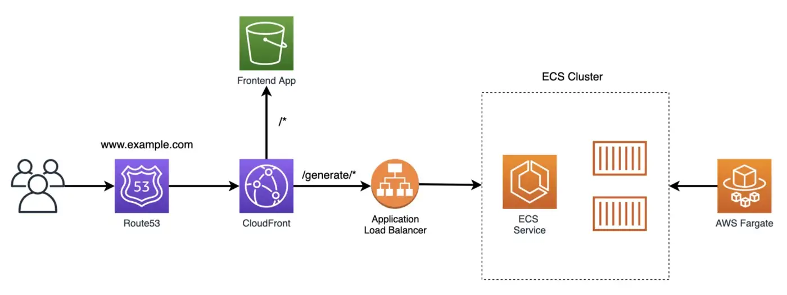

# System diagram 

# Setup
Please modify the content of below files with your own values

`/lib/config.ts` - domainName, hostedZoneName

`cdk.json`       - certificateArn

`/frontend/src/App.js`  - yourDomainName

`/lib/cloudfront.ts` - line 85, `recordName` should be the prefix of your domain name, for example if your domain name is abc.domain.com, then it would be `recordName: "abc"`

# Welcome to your CDK TypeScript project

This is a blank project for CDK development with TypeScript.

The `cdk.json` file tells the CDK Toolkit how to execute your app.

## Useful commands

* `npm run build`   compile typescript to js
* `npm run watch`   watch for changes and compile
* `npm run test`    perform the jest unit tests
* `npx cdk deploy`      deploy this stack to your default AWS account/region
* `npx cdk diff`        compare deployed stack with current state
* `npx cdk synth`       emits the synthesized CloudFormation template
